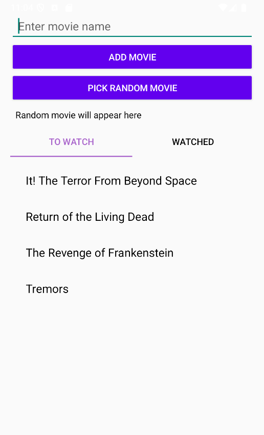
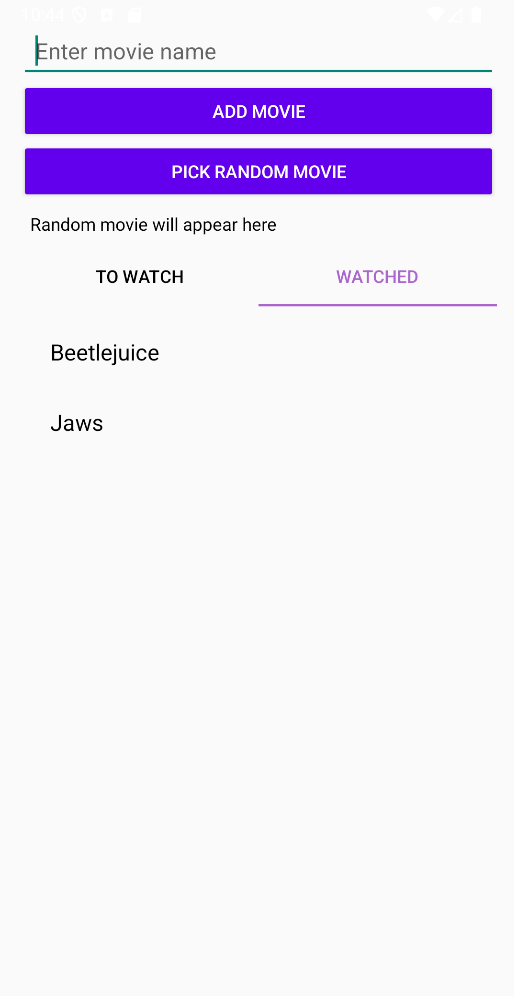

# Android app ReelChoice
## Artifact Summary

ReelChoice is an Android application designed to help users quickly decide what movie to watch by combining curated recommendations with a streamlined, 
user‑friendly interface. This artifact demonstrates core mobile development skills including MVVM architecture, ViewModel state management, 
RecyclerView UI patterns, and asynchronous data handling.

<h3 style="text-align:center; display:block; width:100%;">Application Screenshots</h3>

  
  

---

## Original Java Code

**[ReelChoice](https://github.com/RPG978/RPG978.github.io/tree/main/assets/artifacts/ReelChoice)**

---

## Code Review Video

This review opens with a short app demo and then breaks down the MVVM architecture, focusing on how its layers abstract responsibilities to keep the source code clean with increased usability.

**[View Code Review Video](https://youtu.be/x3r2B3bXwQQ)**

---

## Narrative

### Purpose of the Artifact
The purpose of ReelChoice is to create a small, reliable tool that makes a personal tradition a simpler task to complete. Each October, my wife and I work through a list of scary movies, and the process of tracking titles, deciding what comes next, and keeping the list updated used to involve handwritten notes and dice rolls. ReelChoice was created to streamline that into a lightweight app that stores our movie list, keeps track of what we’ve already watched, and selects a random film from the remaining options.

At its core, ReelChoice exists to make a familiar routine easier and more enjoyable. It focuses on the small set of interactions that matter for this specific use case; adding movies quickly, editing or removing entries, moving films between “To Watch” and “Watched,” and generating a random pick with a single tap. This artifact demonstrates how a focused, purpose-built tool can meaningfully improve a personal experience without needing complex features or external services.

Although the app grew out of a personal tradition, its purpose extends beyond that tradition. ReelChoice serves as a practical example of how a simple idea can be shaped into a clean, functional Android application. It shows how modest projects can clarify architectural thinking, reinforce good habits around data flow and UI state, and provide a foundation for future enhancements or more ambitious mobile work.

### Design Intent & Early Planning
I wanted an app that felt immediate. Open it, add a film, shuffle the list, pick something to watch, and close it again. That meant keeping the scope intentionally narrow and focusing on a workflow leading to results.

Early planning centered on defining the simplest structure that could support that workflow. I had recently completed a weight tracking app, so many of the design principles I learned building the tracker could be applied to this new project. I sketched out a page containing two lists including movies we planned to watch and movies we had already seen. I then mapped the small set of actions a user would need to move items between them. From there, I outlined the basic screens and interactions including an entry field, tabs to change views, a delete option, and a quick action for selecting a random film. I also planned for a local database from the start, since persistence was essential and the app didn’t need network features or external APIs.

These early decisions shaped the entire project. By committing to a minimal scope and a clear interaction model, I could focus on building an app that felt purposeful and uncluttered, while still giving myself room to explore modern Android patterns.

### Skills Demonstrated
- __MVVM architecture__ - Implemented a clear separation of concerns using ViewModels, a Repository layer, and Room-backed data sources to maintain predictable data flow and UI state.
- __ViewModel state management__ - Used ViewModels to expose LiveData streams, handle user actions, and ensure UI components remained lifecycle aware and resilient to configuration changes.
- __RecyclerView UI patterns__ - Built efficient list rendering with adapters, view holders, and swipe gestures to support editing, deleting, and moving items between lists.
- __Asynchronous data handling__ - Managed background work using a single threaded executor to keep database operations off the main thread and maintain a responsive UI.
- __Data persistence__ - Designed and implemented a Room database with DAOs and entities to store user entered movies and maintain long term app state.
- __UI/UX development__ - Created a minimal, intuitive interface focused on quick interactions, clear list organization, and frictionless navigation between core actions.

### Challenges & Lessons Learned
One of the earliest challenges in building ReelChoice was designing the interaction model around swiping and tab navigation. Getting these gestures to behave consistently proved more complex than expected. To keep the interaction purposeful rather than confusing, I had to ensure swipes were only enabled when they made sense; disabling left and right swipes where it would do nothing. This process taught me how subtle UI mechanics can be, and how much setting constraints can contribute to a clean user experience.

Time pressure also shaped the project. I built the first prototype in under 48 hours so it would be ready for the October season. It worked, but it carried rough edges. Swipe behavior was inconsistent, editing wasn’t implemented, navigation relied on swiping instead of tabs, and sorting was nonexistent. After the season ended, I returned to the project with fresh perspective and rebuilt it into a stable beta. That experience taught me the difference between “functional enough for now” and “structured enough to grow,” and how revisiting a rushed prototype can be an opportunity to refine both code quality and design clarity.

Tooling presented its own challenges. Gradle was unforgiving. Renaming classes or reorganizing files often caused build failures because other parts of the project still referenced the original names. Gradle surfaced the errors, but the underlying issue was the tight coupling between Android components and their identifiers. Understanding gradle expectations, cleaning builds, and avoiding careless refactors became an important part of the development process. It taught me that Android tooling rewards consistency and punishes shortcuts, and that stable builds depend on respecting the project’s underlying structure.

Because the project was built quickly, I didn’t develop meaningful unit tests during the initial sprint. I experimented with Java and Kotlin testing frameworks, but the tests I added were more exploration than useful. This highlighted how testing often gets deprioritized under time constraints, and how much smoother development becomes when tests are planned early rather than bolted on later.

Finally, ReelChoice’s interface remains intentionally minimal, but that simplicity also reflects a limitation. There’s no front page or menu system, and the app currently supports only a single list pair. While this fits the original purpose, it leaves room for future expansion such as supporting multiple genres or separate watchlists. This taught me that minimalism is valuable, but planning for extensibility can make future enhancements easier when inspiration strikes.

---

[<- Back to Portfolio](index.md)
