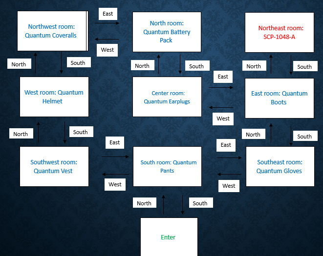
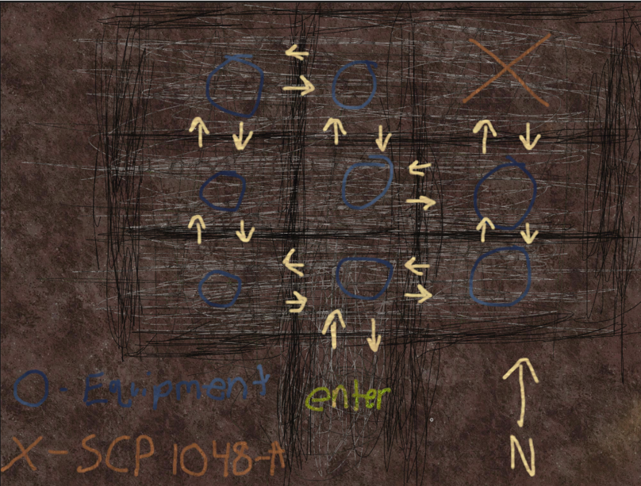

# Python SCP Game

## Artifact Summary
This project is a Python based text adventure game built around a simple room navigation system. 
The player moves through a grid of rooms, collects eight pieces of equipment, and eventually encounters a boss. 
It’s fully playable in its current form, but intentionally minimal. The project demonstrates core Python competencies such as 
procedural logic, branching paths, and simple state management.

---

<h3 style="text-align:center; display:block; width:100%;">Storyboard & Conceptual Maps</h3>

<div style="display: flex; gap: 20px; justify-content: center;">
  
  
</div>

<p align="center"><em>Storyboard (left) and conceptual layout (right) created during early planning.</em></p>

## Original Python Code
<details markdown="1">
<summary><strong>Click to view original Python code</strong></summary>

```python
# Christopher Poole
# IT - 140 Text Based Game
import os  # used to operate cls


# Greeting message
def show_instructions():
    # print main message and instructions
    print('You have been escorted into a dark room by armed guards. They leave, locking the door.'.center(89, '-'))
    print('After a few moments the lights click on and you hear a voice over the intercom:'.center(90, '-'))
    print('"D-class personnel, enter the containment area.'.center(90, '-'))
    print('Equip the 8 pieces of protective equipment found in each room.'.center(90, '-'))
    print('You will then travel to the Northeast corridor and interact with SCP-1048-A.'.center(90, '-'))
    print(''
          '"'.center(90, '-'))
    print('On a nearby table, you see a haggard sketch of the area.'.center(90, '-'))
    print('\n')

    # map visual
    map_item = '0'  # denote objects to avoid errors involving tuples
    wall = '*'
    enemy_room = '*  O  *  O  *  X  *'
    room = '*  O  *  O  *  O  *'
    entrance_room = '*******-- --*******'
    while wall != 'q':
        print((wall * 19).center(90, ' '))  # wall
        print(enemy_room.format(map_item).center(90, ' '))
        print((wall * 19).center(90, ' '))  # wall
        print(room.format(map_item).center(90, ' '))
        print((wall * 19).center(90, ' '))  # wall
        print(room.format(map_item).center(90, ' '))
        print(entrance_room.center(90, ' '))  # wall
        print('\n')
        break

    print("Move commands: Go North, Go South, Go East, Go West.".center(90, '-'))
    print("Equip item: Equip 'item name'.".center(90, '-'))
    # print("Exit game: Type 'Exit'.".center(90, '-'))

    input("Enter any key to continue...".center(90, '-'))


def clear():  # Portability
    os.system('cls' if os.name == 'nt' else 'clear')  # non-Windows

# map dictionary


rooms = {
    'Entrance': {'North': 'South Room'},
    'South Room': {'East': 'Southeast Room', 'West': 'Southwest Room', 'item': 'Quantum Pants'},
    'Southeast Room': {'West': 'South Room', 'North': 'East Room', 'item': 'Quantum Gloves'},
    'East Room': {'West': 'Center Room', 'North': 'Northeast Room', 'South': 'Southeast Room', 'item': 'Quantum Boots'},
    'Center Room': {'North': 'North Room', 'East': 'East Room', 'item': 'Quantum Earplugs'},
    'North Room': {'West': 'Northwest Room', 'South': 'Center Room', 'item': 'Quantum Battery Pack'},
    'Northwest Room': {'South': 'West Room', 'East': 'North Room', 'item': 'Quantum Coveralls'},
    'West Room': {'North': 'Northwest Room', 'South': 'Southwest Room', 'item': 'Quantum Helmet'},
    'Southwest Room': {'North': 'West Room', 'East': 'South Room', 'item': 'Quantum Vest'},
    'Northeast Room': {'South': 'East Room', 'Boss': 'SCP-1048-A'}
    }

# List that tracks equipment
equipment = []

# Tracks current room
current_room = 'Entrance'

# List containing last move to be appended
msg = " "

# List of vowels
vowels = ['a', 'e', 'i', 'o', 'u']

clear()
show_instructions()

# Gameplay loop
while True:

    # clears terminal after each iteration
    clear()

    # Info display
    print(f"You are in the {current_room}\nEquipment : {equipment}\n{'-' * 30}")

    # Display msg
    print(msg)

    # Item check
    if "item" in rooms[current_room].keys():

        room_item = rooms[current_room]["item"]

        if room_item not in equipment:

            # Plural block specific for this game
            if room_item[-1] == 's':
                print(f"You see {room_item}")

            elif room_item[0] in vowels:
                print(f"You see an {room_item}")

            else:
                print(f"You see a {room_item}")

    # Boss
    if "Boss" in rooms[current_room].keys():

        # lose condition
        if len(equipment) < 8:
            print(f"A lonely teddy bear stands in front of you. It is made of human ears.".center(90, '-'))
            print('You hear a high-pitched shriek.'.center(90, '-'))
            print(f"Pain erupts from every orifice. Ears begin to grow all over your body.".center(90, '-'))
            print(f'The last thing you recognize is the voice over the intercom:'.center(90, '-'))
            print(f'"Test 4-ac complete. Subject terminated."'.center(90, '-'))
            print('\n')

            print('You died. Game Over.'.center(90, '-'))
            break

        # win condition
        else:
            print(f"You recognize the shape of a teddy bear in front of you. It is made of human ears.".center(90, '-'))
            print(f"The bear appears to vibrate, but you cannot hear anything.".center(90, '-'))
            print(f'After some time, a voice comes over the intercom inside your helmet:'.center(90, '-'))
            print(f'"D-Class personnel, return to the entrance. Today, you have earned your freedom."'.center(90, '-'))
            print('\n')
            print('You leave Site-24 alive, and as a free person. You Win!!!'.center(90, '-'))
            break

    # Player's move
    user_input = input("Enter your move:\n")

    # Split move
    next_move = user_input.split(' ')

    # First word
    action = next_move[0].title()  # title case to accept any case

    direction = 0
    item = 0
    if len(next_move) > 1:
        item = next_move[1:]  # List slice to get any words following first
        direction = next_move[1].title()  # Always first word

        item = ' '.join(item).title()  # used to join multiple items

    # Moving between rooms
    if action == "Go":  # [0] 1st acceptable input

        try:
            current_room = rooms[current_room][direction]
            msg = f"You travel {direction}."

        except:
            msg = f"You can't go that way."

    # Picking up items
    elif action == "Equip":  # [0] 2nd acceptable input

        try:
            if item == rooms[current_room]["item"]:

                if item not in equipment:

                    equipment.append(rooms[current_room]["item"])
                    msg = f"{item} equipped"

                else:
                    msg = f"You already have the {item} equipped."

            else:
                msg = f"Can't find {item}."

        except:
            msg = f"Can't find {item}."

    # Exit game
    # elif action == "Exit":
        # break

    # Any other commands invalid
    else:
        msg = "Invalid command"
```

</details>

- **Download / View Original Code:**  
**[original.py](https://github.com/RPG978/RPG978.github.io/tree/main/assets/artifacts)**
  
---
## Code Review Video
Below is my code review video, where I walk through the original artifact, analyze its structure and functionality, and explain the enhancements I planned and implemented.


**[Code Review Video](https://youtu.be/vSFbwwrb2HU)**


---
## Narrative

### Purpose of the Artifact
The original Python SCP game was created early in my academic program as part of IT 140: Introduction to Scripting. The assignment required building a small, text based adventure that demonstrated basic programming constructs such as user input, branching logic, and simple state management. Although the project was modest in scope, it represented my first attempt at designing an interactive experience and translating a narrative concept into working code. This artifact captures the starting point of my development journey before I later rebuilt and expanded the game in C++.

### Design Intent & Early Planning
Before writing any Python code, I approached the project the way a game designer would: by defining the world, mapping the player’s path, and outlining the core interactions. I created original concept art and a storyboard map to visualize the environment, identify key rooms, and determine how the player would navigate the containment area. These early drawings helped establish the tone of the game and clarified where equipment, hazards, and the final encounter should be placed.
Alongside the visual planning, I drafted pseudo code to outline the game loop, navigation logic, and item collection flow. This allowed me to break the project into manageable components and understand how each part of the system would interact. I also prepared a small design presentation that summarized the game’s structure, objectives, and progression. This step helped me articulate the intended player experience and ensured that the implementation stayed aligned with the original concept.
Together, the storyboard, conceptual map, pseudo code, and design presentation formed a lightweight pre production pipeline. Even though the final Python version was simple, these planning materials guided the structure of the game, informed the room layout and interactions, and helped me think about the project as a cohesive experience rather than a collection of disconnected functions.
Implementation & Core Features
The Python implementation used a procedural, single file structure typical of early scripting projects. The game allowed the player to move between rooms, collect equipment, and progress toward a final encounter. Core features included a simple navigation system based on directional input, room descriptions and item discovery, basic state tracking for collected equipment, conditional logic that determined whether the player could progress, and a linear win/lose condition based on the player’s choices.
While limited compared to the later C++ redesign, the Python version successfully demonstrated the fundamentals of interactive storytelling and control flow. It also provided the conceptual foundation for the more advanced systems I would later build.

### Skills Demonstrated
- __Basic control flow and branching logic__
- __User input handling and validation__
- __Procedural game loop design__
- __Early state management techniques__
- __Foundational game design planning__
- __Use of storyboard and conceptual mapping to guide implementation__
- __Clear text based UX messaging__
- __Translating narrative ideas into functional code__

### Challenges & Lessons Learned
Building the Python SCP game taught me how to break a narrative concept into manageable programming tasks. One of the first challenges was structuring the game flow so that navigation, item collection, and progression felt coherent despite the limitations of a single file script. I learned the importance of organizing logic clearly, avoiding duplicated code, and thinking ahead about how different parts of the game would interact.
Another lesson came from debugging. Early versions of the game revealed how easily inconsistent state or missing conditions could break the experience. Fixing these issues helped me understand the value of predictable control flow and careful sequencing of checks.
Finally, working with the storyboard and conceptual map showed me how valuable visual planning can be, even for small projects. These early design tools made the implementation smoother and helped me think like a developer rather than just a script writer. The experience ultimately prepared me for the more advanced architectural work I later performed in the C++ version of the game.

---
## Enhanced Artifact
The enhanced version of this project was implemented in C++ and is available here:

**[SCP Game Page](SCP_Artifact.md)**

---
[<- Back to Portfolio](index.md)
